# AgendamentosGW

Trabalho do PAC - Projeto de Aprendizagem Colaborativa Extensionista do Curso de Engenharia de Software da Católica de Santa Catarina III e IV.

Sistema de agendamento para recursos feito para agendar certos recursos, como Carrinhos de Chromebook, Tablets e etc para utilizar em alguma aula. O Sistema foi feito para a Escola Municipal Prefeito Geraldo Wetzel.

[Vídeo de apresentação](https://youtu.be/CHGcBB84i4M)


## Alunos

- Andrey Garcia dos Santos
- Graziela Torres
- Henrique Maia Cardosa
- João Miguel de Castro Menna
- Ricardo Gabriel Fialho Santos
- Sophia Eggert Freire da Rocha


## Prints de todas as telas

Tela de login - Lugar onde entramos no sistema
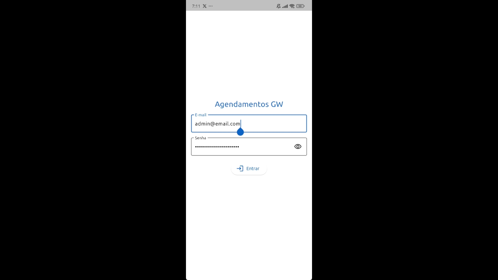


Drawer - Lugar onde temos links para outras telas do sistema
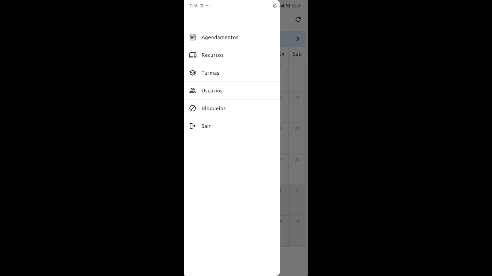


Tela de agendamento - calendário - Lugar onde visualizamos os agendamentos em modo calendário
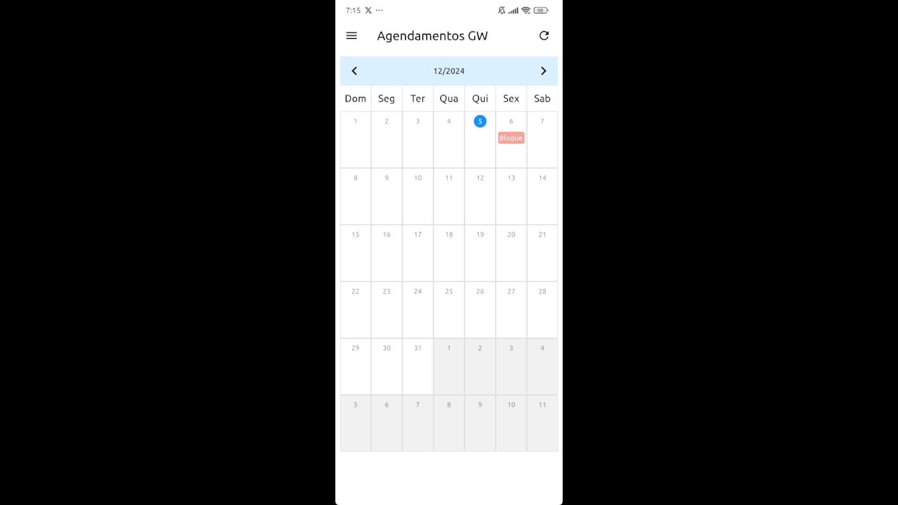


Tela de agendamentos - timeline - Lugar onde visualizamos os agendamentos em modo timeline (por dia)
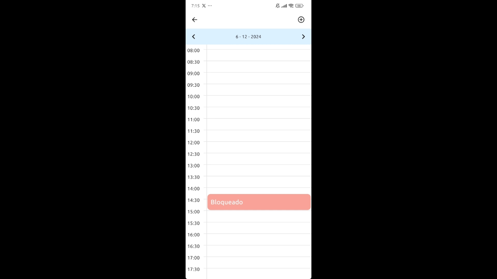


Tela de adicionar agendamentos - Lugar onde adicionamos agendamentos novos no calendário
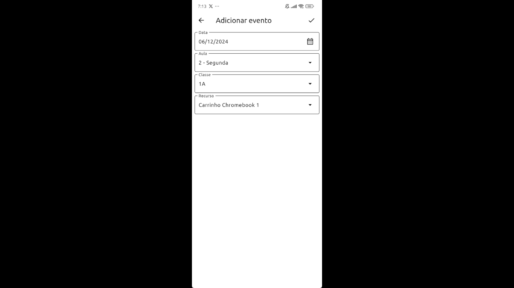


Tela de usuários - apenas admin - Lugar onde visualizamos todos os usuários do sistema
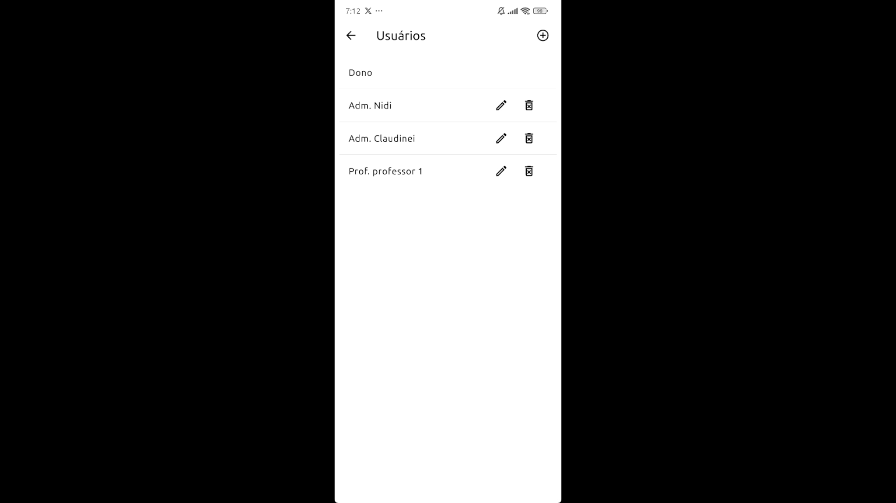


Tela de adicionar usuários - apenas admin - Lugar onde adicionamos novos usuários
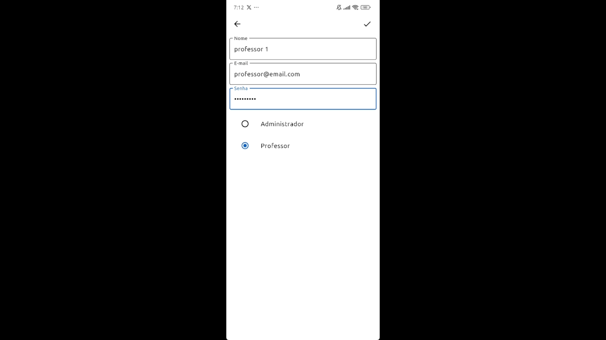


Tela de turmas - apenas admin - Lugar onde visualizamos todas as turmas do sistema
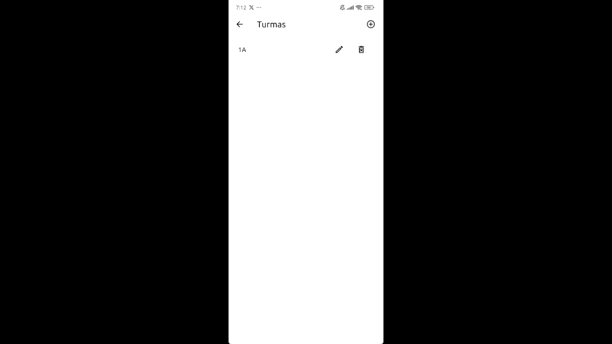


Tela de adicionar turmas - apenas admin - Lugar onde adicionamos novas turmas e recursos relacionados
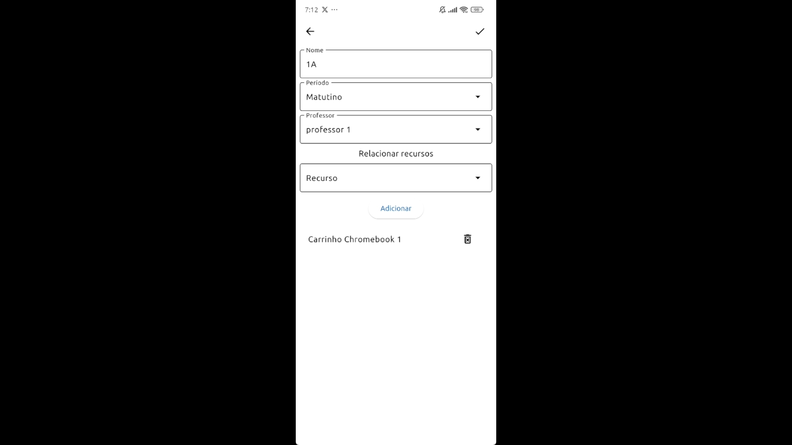


Tela de recursos - apenas admin - Lugar onde visualizamos todos os recursos do sistema
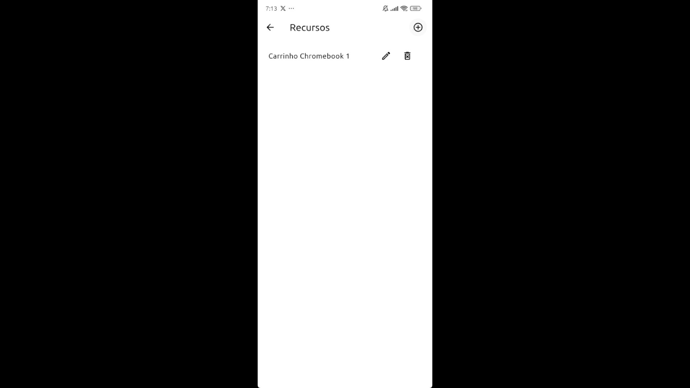


Tela de adicionar recursos - apenas admin - Lugar onde adicionamos novos recursos
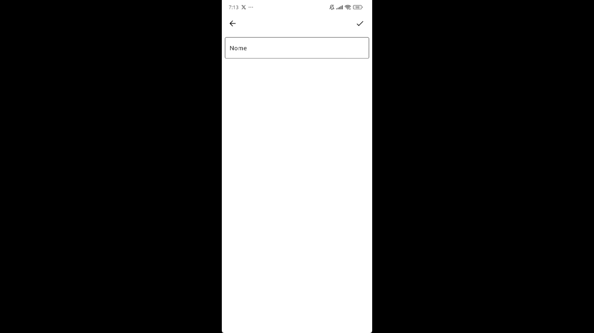


Tela de bloqueios - apenas admin - Lugar onde visualizamos todos os bloqueios do sistema
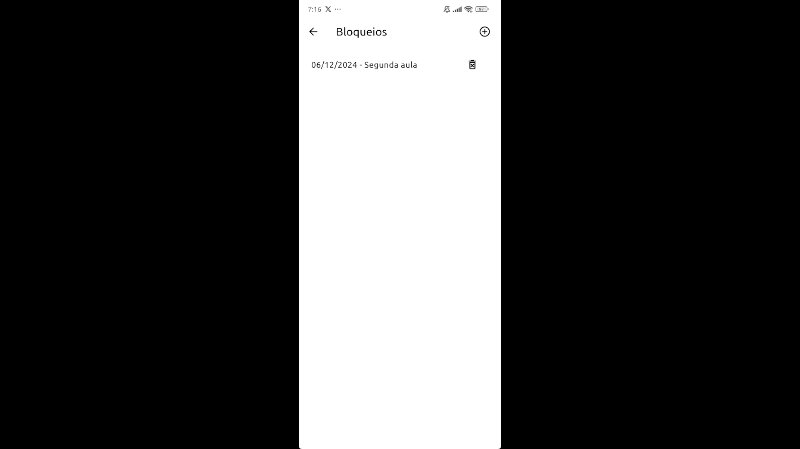


Tela de adicionar bloqueios - apenas admin - Lugar onde adicionamos novos bloqueios
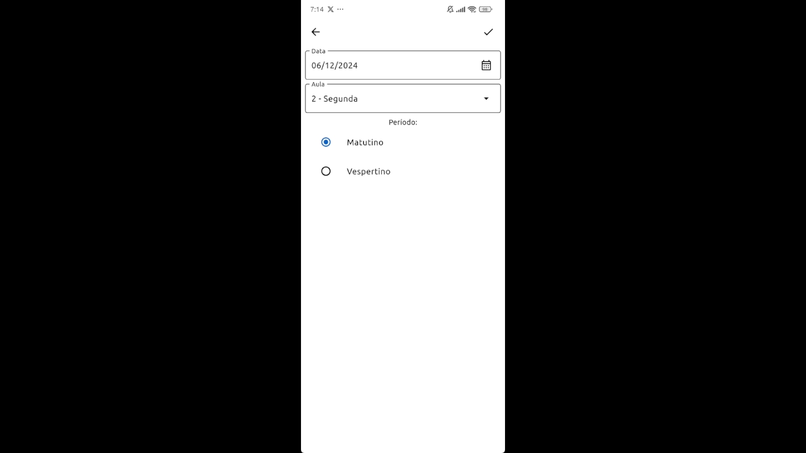


## Como montar o ambiente de desenvolvimento

### Pré-requisitos:

- PostgreSQL 16+
- Node 18.19
- Yarn (rode `npm i -g yarn` para instalar)
- Flutter e suas dependências para desenvolvimento Desktop

### Instruções

#### Back-end

- Verifique se a ferramenta `psql` (manipulador de banco de dados)
está na variável de ambiente PATH. Caso não esteja, adicione o caminho ao seu PostgreSQL
(caminho padrão da instalação: `C:\Program Files\PostgreSQL\16\bin`)
- Crie um banco de dados no PostgreSQL:

```
$ psql -U postgres
$ create database agendamentosgw
```

- Entre na pasta `.\AgendamentosGW\backend`
- Crie um arquivo ao lado do `.env.example` chamado `.env`.
- Escreva o seguinte conteúdo nesse arquivo `.env`, lembre-se de trocar o `<segredo>` pela sua senha do usuario do PostgreSQL:

```
PORT=8080
LOGGER=false
JWT_PRIVATE_KEY="uma frase muito secreta"
FIRST_TIME_TOKEN=""
PGHOST="localhost"
PGDATABASE="agendamentosgw"
PGUSER="postgres"
PGPASSWORD="<segredo>"
```

- Entre com um terminal na pasta `.\AgendamentosGW\backend`
- Vamos instalar os pacotes, certifique-se de estar na pasta correta e rode o comando `yarn`
- Precisamos botar o banco de dados em dia, por isso, deve ser rodado as migrations. Rode o comando `yarn migrate`
- Chegou a hora de executar o back-end. Execute o comando `yarn dev` e aguarde a mensagem `Server running in port 8080`
- Para testar a API, foi criado uma coleção no Insomnia. Baixe o programa e importe a coleção (localizada em `.\AgendamentosGW\docs\AgendamentosGW-Insomnia.json`)
    - Troque o Environment para `Local`.
    - O sistema começa na pasta `System`, onde você consegue, através da request `systemFirstTime`, criar um primeiro usuário na plataforma.
    - Troque as informações no body pelas informações desejadas e envie a request.
    - Após isso, vá para a pasta `Users` e procure a request `login`. Através dessa request, você deve enviar os dados corretos para garantir o token.
    - Com o token em mãos, configure o Environment: você deverá trocar a chave `token` para o token que acabou que criar.
    - O token tem expiração de 24 horas, então a cada 24 horas, se for usar o Insomnia, você deve fazer o processo acima.
 
#### Front-end

- Entre com um terminal na pasta `.\AgendamentosGW\frontend`
- Execute o comando `yarn` para baixar todas as dependências
- Rode o front-end com o comando `yarn dev`
- Ao realizar o login, o usuário irá visualizar a tela de Agendamentos
- Na lateral direita está disponível um menu lateral com as áreas do projeto, sendo elas: "Agendamentos", "Recursos", "Turmas" e "Usuários"
- As telas "Recursos", "Turmas" e "Usuários" só poderão ser vista por usuários do tipo "Admin"
- Usuários do tipo "Professor" terão somente acesso a tela de agendamentos e ao botão de sair/deslogar.
- Para o calendário foi usado o componente FullCalendar https://fullcalendar.io/
- No agendamento não é possível editar um agendamento, apenas criar e excluir
- Existem três CRUDs dentro do projeto: sendo eles, as telas de Recursos, Usuários e Turmas

#### Front-end mobile (Flutter)

- Entre com um terminal na pasta `.\AgendamentosGW\flutter_frontend`
- Execute o comando `flutter pub get` para baixar todas as dependências
- Rode o front-end com o comando `flutter run` ou rode pelo VSCode.
